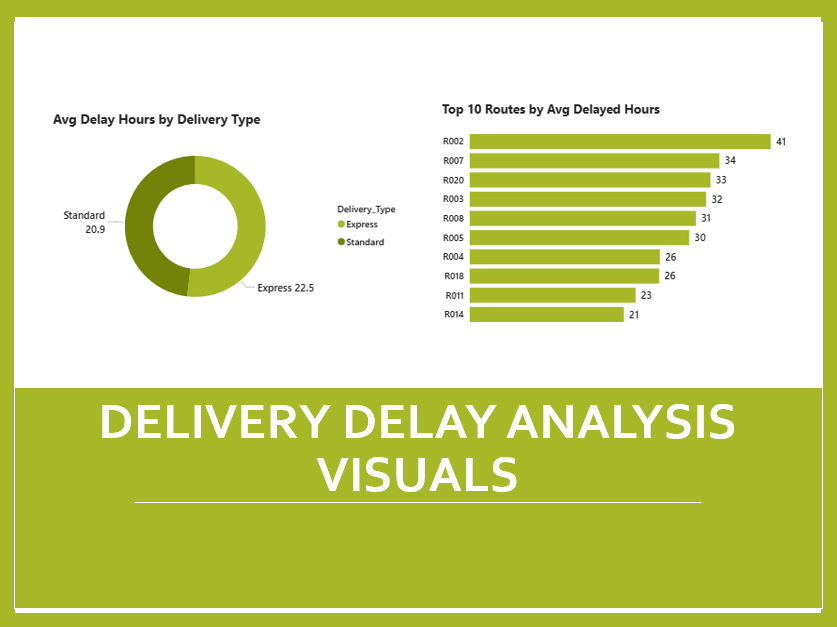
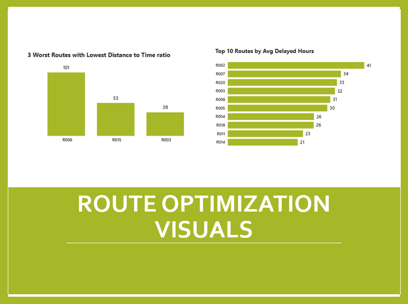
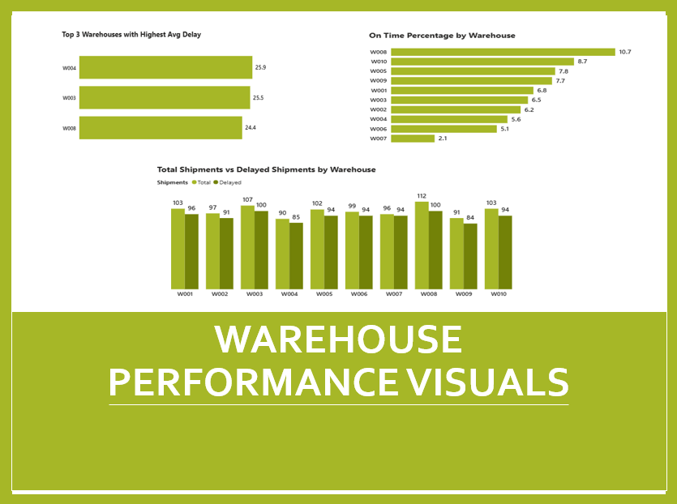
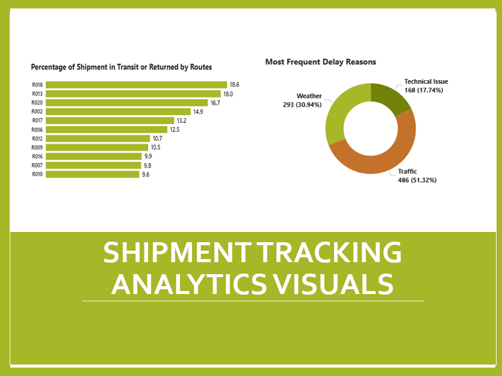
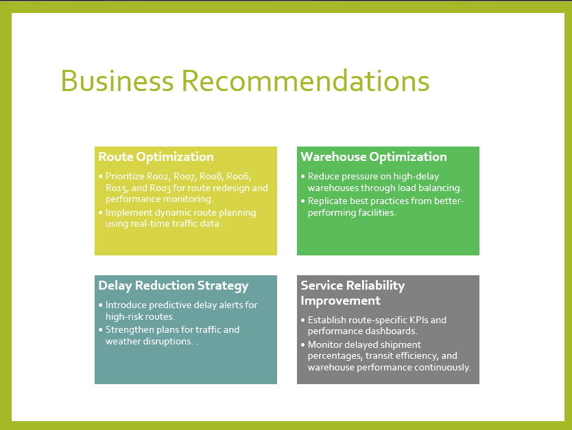

# 🚚 FedEx Logistics Optimization Analytics

## 📌 Project Overview

FedEx operates one of the world's largest logistics networks, connecting over 220 countries through global transportation hubs and last-mile delivery partners.

As e-commerce volumes continue to grow, delays caused by traffic congestion, weather disruptions, customs clearance, and warehouse bottlenecks impact operational efficiency and customer satisfaction.

This project uses **SQL-based analytics** to identify delay patterns, optimize transportation routes, evaluate warehouse performance, and generate actionable recommendations to improve logistics operations.

---

## 🎯 Objectives

- Identify shipment delay patterns and operational bottlenecks
- Optimize route efficiency across the logistics network
- Evaluate warehouse performance and utilization
- Analyze delivery agent effectiveness
- Improve on-time delivery rates
- Generate business recommendations for operational improvement

---

## 🗂 Dataset Overview

### Orders Table

| Column |
|----------|
| Order_ID |
| Customer_ID |
| Order_Date |
| Route_ID |
| Warehouse_ID |
| Order_Amount |
| Delivery_Type |
| Payment_Mode |

### Routes Table

| Column |
|----------|
| Route_ID |
| Source_City |
| Source_Country |
| Destination_City |
| Destination_Country |
| Distance_KM |
| Avg_Transit_Time_Hours |

### Warehouses Table

| Column |
|----------|
| Warehouse_ID |
| City |
| Country |
| Capacity_per_day |
| Manager_Name |

### Delivery Agents Table

| Column |
|----------|
| Agent_ID |
| Agent_Name |
| Zone |
| Zone_Country |
| Experience_Years |
| Avg_Rating |

### Shipments Table

| Column |
|----------|
| Shipment_ID |
| Order_ID |
| Agent_ID |
| Route_ID |
| Warehouse_ID |
| Pickup_Date |
| Delivery_Date |
| Delivery_Status |
| Delay_Hours |
| Delivery_Feedback |

---

## 🧹 Data Cleaning & Preparation

### Data Quality Checks Performed

- Removed duplicate Order_ID and Shipment_ID records
- Replaced missing Delay_Hours using route-level average delays
- Standardized date formats using SQL date functions
- Flagged invalid records where Delivery_Date < Pickup_Date
- Validated referential integrity between all tables
- Checked for missing and inconsistent values

### SQL Concepts Used

- JOINs
- CTEs
- Window Functions
- Aggregate Functions
- CASE Statements
- Subqueries
- Date Functions

---

## 📊 Key Analyses Performed

### 1. Shipment Performance Analysis

- Total Shipments
- Delayed Shipments
- On-Time Delivery Percentage
- Average Delay Hours
- Customer Feedback Analysis

### 2. Route Optimization Analysis

- Average Delay by Route
- Delayed Shipment Percentage by Route
- Distance-to-Time Efficiency Analysis
- Route Performance Ranking

### 3. Warehouse Performance Analysis

- Warehouse Utilization
- Shipment Volume Analysis
- Average Delay by Warehouse
- On-Time Delivery Percentage

### 4. Delivery Agent Performance Analysis

- Agent Rating Analysis
- Top Performing Agents
- Low Performing Agents
- Experience vs Performance

### 5. Delay Reason Analysis

- Traffic Delays
- Weather Delays
- Technical Issues

### 6. Geographic Delay Analysis

- Country-wise Average Delays
- International Route Performance

---

## 📈 Key Findings

### Route Performance

| Route | Finding |
|---------|---------|
| R002 | Highest Average Delay (41 hrs) |
| R008 | Highest Delayed Shipment Percentage |
| R006 | Worst Distance-to-Time Efficiency |

---

### Warehouse Insights

- W004 recorded the highest average delay hours.
- W003 and W008 also showed elevated delay levels.
- W010 and W005 had the highest utilization rates.
- Significant imbalance exists in warehouse workload distribution.

---

### Delay Analysis

| Reason | Percentage |
|----------|-----------|
| Traffic | 51.3% |
| Weather | 30.9% |
| Technical Issues | 17.7% |

Traffic-related disruptions were the primary cause of shipment delays.

---

### Geographic Insights

| Country | Avg Delay (Hours) |
|-----------|----------------|
| UAE | 41 |
| Turkey | 33 |
| China | 33 |
| Singapore | 32 |
| UK | 30 |

International routes experienced significantly higher delay durations.

---

## 💡 Business Recommendations

### Route Optimization

- Prioritize Route R002, R007, and R008 for operational review.
- Implement dynamic route planning.
- Reduce unnecessary hub transfers.
- Improve monitoring of high-risk corridors.

### Warehouse Optimization

- Balance shipment loads across warehouses.
- Increase staffing during peak demand periods.
- Adopt best practices from high-performing facilities.

### Delay Reduction

- Deploy predictive delay monitoring systems.
- Improve traffic-aware route planning.
- Strengthen weather disruption contingency planning.

### Agent Performance Improvement

- Introduce mentorship programs.
- Implement KPI-based performance monitoring.
- Provide targeted training for low-performing agents.

---

## 🛠 Tools & Technologies

- SQL
- MySQL Workbench
- Data Analysis
- Logistics Analytics
- Business Intelligence

---

## 📷 Dashboard & Analysis Screenshots

### Delivery Delay Analysis

### Route Efficiency Analysis

### Warehouse Performance

### Shipment Tracking Analysis

### Recommendations

---

## 🎯 Project Outcome

This project successfully identified:

✅ High-delay transportation routes

✅ Inefficient route networks

✅ Warehouse performance bottlenecks

✅ Primary shipment delay drivers

✅ Opportunities for workload balancing

✅ Areas for logistics process improvement

The insights generated can help improve operational efficiency, reduce delays, optimize resource utilization, and enhance customer satisfaction across FedEx's global logistics network.
